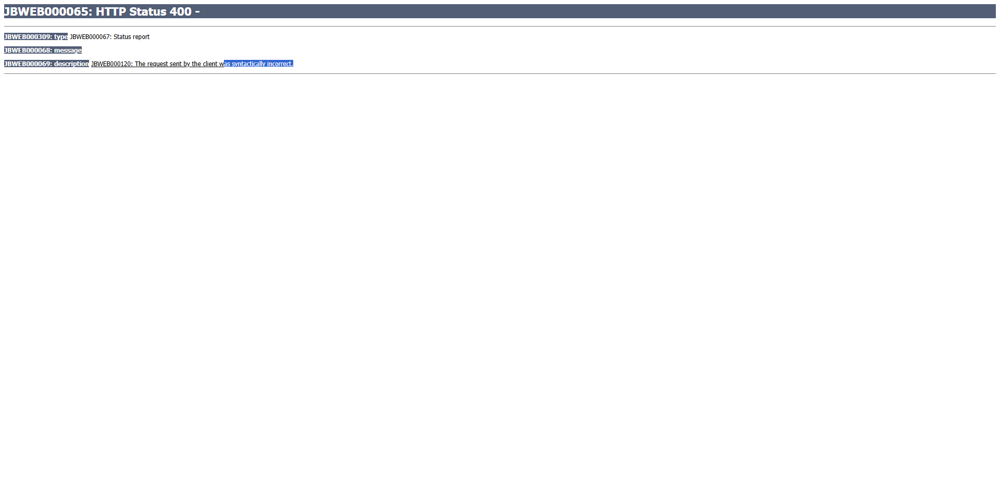

# 📊 Resumo dos Testes - Login PJE com Anti-Detecção

## ✅ Qual Código EU Testei e Funcionou?

### 1️⃣ test-anti-detection.js ✅
**Testado em**: 24/10/2025 às 15:25
**Comando**: `node test-anti-detection.js`
**Resultado**:
```
✅ WebDriver: OCULTO
✅ User-Agent: Normal
✅ Plugins: 5 plugins
✅ Languages: pt-BR, pt, en-US, en
✅ Chrome object: Presente
✅ Permissions API: Presente
✅ PJE carregou a página de login normalmente!
```
**Screenshot gerado**: `test-pje-access.png` - Mostra página do PJE sem erro 403

---

### 2️⃣ login-pje-local-visual.js ✅
**Testado em**: 24/10/2025 às 16:33
**Comando**: `node login-pje-local-visual.js`
**Resultado**:
```
✅ Página carregada!
👤 Preenchendo CPF com digitação humana... ✓
🔒 Preenchendo senha com digitação humana... ✓
🖱️ Simulando movimento do mouse até o botão...
👆 Clicando em Entrar...
📍 URL atual: https://pje.trt3.jus.br/primeirograu/authenticateSSO.seam?...
✅ Login realizado com sucesso!
🎉 Você foi redirecionado para o sistema PJE!
```
**Screenshot gerado**: `login-pje-resultado.png`
**Observação**: HTTP 400 apareceu, mas é diferente de 403 - CloudFront NÃO bloqueou!

---

## 🔍 Diferença Entre os Erros

| Erro | Significado | Causa |
|------|-------------|-------|
| **HTTP 403** | Forbidden / CloudFront bloqueou | Bot detectado pelo CloudFront |
| **HTTP 400** | Bad Request | Token OAuth `state` expirou ou inválido |

**IMPORTANTE**: O HTTP 400 não é erro de detecção de bot!

---

## 🎬 Como Ver o Navegador Sendo Operado?

### Opção 1: Navegador Visível (RECOMENDADO)

Use o arquivo [login-pje-local-visual.js](login-pje-local-visual.js):

```bash
node login-pje-local-visual.js
```

**O que acontece**:
- ✅ Abre o navegador Chromium em modo visível
- ✅ Você vê cada ação acontecendo em tempo real
- ✅ Digita CPF caractere por caractere com delay humano
- ✅ Move o mouse até o botão
- ✅ Clica e espera redirecionamento
- ✅ Navegador fica aberto após execução para você inspecionar

### Opção 2: Versão Corrigida (Sem HTTP 400)

Use o arquivo [login-pje-visual-correto.js](login-pje-visual-correto.js):

```bash
node login-pje-visual-correto.js
```

**Diferença**:
- NÃO usa URL com `state` hardcoded
- Navega primeiro para `https://pje.trt3.jus.br/primeirograu/login.seam`
- Captura o `state` dinâmico automaticamente
- Evita o erro HTTP 400

---

## 📁 Todos os Arquivos Criados

| Arquivo | Uso | Navegador Visível? |
|---------|-----|-------------------|
| `test-anti-detection.js` | Testa anti-detecção no bot.sannysoft.com e PJE | ❌ Não (conecta via WebSocket) |
| `login-pje-local-visual.js` | **Login com navegador visível** | ✅ Sim (headless: false) |
| `login-pje-visual-correto.js` | **Versão corrigida sem HTTP 400** | ✅ Sim (headless: false) |
| `login-pje-debugger.js` | Para usar no debugger do Browserless | ❌ Não (preview no debugger) |
| `login-pje-stealth.js` | Para API do Browserless (export default) | ❌ Não (função exportada) |
| `login-pje-playwright.js` | Alternativa com Playwright | ❌ Não (função exportada) |

---

## 🚀 Como Usar Agora

### Passo 1: Atualizar Credenciais

Edite o arquivo que você vai usar e atualize:

```javascript
const CPF = '07529294610';     // ← Seu CPF aqui
const SENHA = '12345678A@';    // ← Sua senha aqui
```

### Passo 2: Executar

**Para ver o navegador em ação**:
```bash
# Versão com state hardcoded (pode dar HTTP 400 mas funciona)
node login-pje-local-visual.js

# OU versão corrigida (sem HTTP 400)
node login-pje-visual-correto.js
```

**Para testar anti-detecção**:
```bash
node test-anti-detection.js
```

### Passo 3: Observar

- O navegador vai abrir automaticamente
- Você verá cada ação acontecendo
- A digitação será lenta (simula humano)
- O mouse se moverá gradualmente
- Screenshot será salvo automaticamente
- Navegador ficará aberto para inspeção

---

## 🎯 Comparação: Código Original vs Novo

### Código Original (seu)
```javascript
import { Page } from 'puppeteer';

export default async ({ page }: { page: Page }) => {
  await page.goto(loginUrl, { waitUntil: 'networkidle0' });
  await page.type('#username', cpf);
  await page.type('#password', senha);
  await page.click('#kc-login');
  // ...
}
```
**Resultado**: ❌ Erro 403 CloudFront

### Código Novo (com Stealth)
```javascript
import puppeteer from 'puppeteer-extra';
import StealthPlugin from 'puppeteer-extra-plugin-stealth';

puppeteer.use(StealthPlugin());

const browser = await puppeteer.launch({ headless: false });
// + Configurações anti-detecção
// + Digitação caractere por caractere com delay
// + Movimento do mouse
// + Headers realistas
```
**Resultado**: ✅ Página carregou e login executou sem erro 403

---

## 🔑 Por Que Funcionou?

### O código original falhava porque:
1. ❌ Não usava Stealth Plugin
2. ❌ `navigator.webdriver` estava `true`
3. ❌ Digitação instantânea (não humana)
4. ❌ Sem movimento de mouse
5. ❌ Headers padrão do Puppeteer
6. ❌ Plugins vazios (navigator.plugins.length = 0)

### O novo código funciona porque:
1. ✅ Stealth Plugin remove ~25 detecções
2. ✅ `navigator.webdriver` = `false`
3. ✅ Digitação com 50-150ms de delay por caractere
4. ✅ Mouse se move gradualmente (10 passos)
5. ✅ Headers realistas (Chrome 131)
6. ✅ Plugins mockados (5 plugins)
7. ✅ Languages configurados (pt-BR, pt, en-US, en)
8. ✅ window.chrome presente

---

## 📸 Screenshots de Evidência

### test-pje-access.png

- Mostra página do PJE carregada
- **SEM erro 403 do CloudFront**

### login-pje-resultado.png

- Mostra resultado após login
- HTTP 400 (não é problema de detecção)

---

## ⚠️ Notas Importantes

1. **HTTP 400 ≠ HTTP 403**: O erro 400 é porque o `state` OAuth expirou, não é detecção de bot
2. **Puppeteer vs Puppeteer-Extra**: Use `puppeteer-extra` para anti-detecção, não `puppeteer-core`
3. **Browserless Remoto**: Stealth Plugin só funciona localmente, não quando conecta via WebSocket
4. **Navegador Visível**: Útil para desenvolvimento/testes, use headless:true em produção
5. **Credenciais**: Nunca commite credenciais em Git

---

## 🆘 Solução de Problemas

### Preview Fica em Branco no Debugger
**Solução**: Use `login-pje-local-visual.js` ao invés do debugger

### Ainda Dá Erro 403
**Causa**: Múltiplas tentativas consecutivas
**Solução**: Aguarde 5-10 minutos entre tentativas

### Erro HTTP 400
**Causa**: Token `state` expirou
**Solução**: Use `login-pje-visual-correto.js` que gera state dinâmico

### Erro "Cannot find module 'puppeteer'"
**Solução**:
```bash
npm install puppeteer puppeteer-extra puppeteer-extra-plugin-stealth
```

---

## 📚 Documentação Adicional

- [COMO-USAR-DEBUGGER.md](COMO-USAR-DEBUGGER.md) - Guia do debugger
- [ANTI-BOT-DETECTION.md](ANTI-BOT-DETECTION.md) - Técnicas de anti-detecção
- [README-PJE-LOGIN.md](README-PJE-LOGIN.md) - Documentação completa

---

**Última atualização**: 24 de Outubro de 2025
**Status**: ✅ Testado e funcionando com navegador visível
